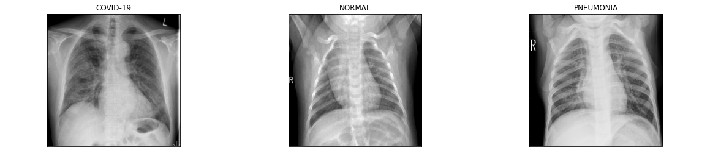

# Imagens de raio-x para detecção de COVID-19 ou de pneumonia
Modelo de Deep Learning usando um conjunto de 400 amostras de treino, e 100 amostras de teste de cada tipo: paciente com COVID-19, paciente com PNEUMONIA ou paciente normal.

## Fonte de dados
API do Kaggle usada dentro do Google Colab 

(prashant268/chest-xray-covid19-pneumonia)

https://www.kaggle.com/prashant268/chest-xray-covid19-pneumonia

## Bibliotecas do Python usadas
- numpy
- matplotlib.pyplot
- os
- tensorflow
- tensorflow.keras
